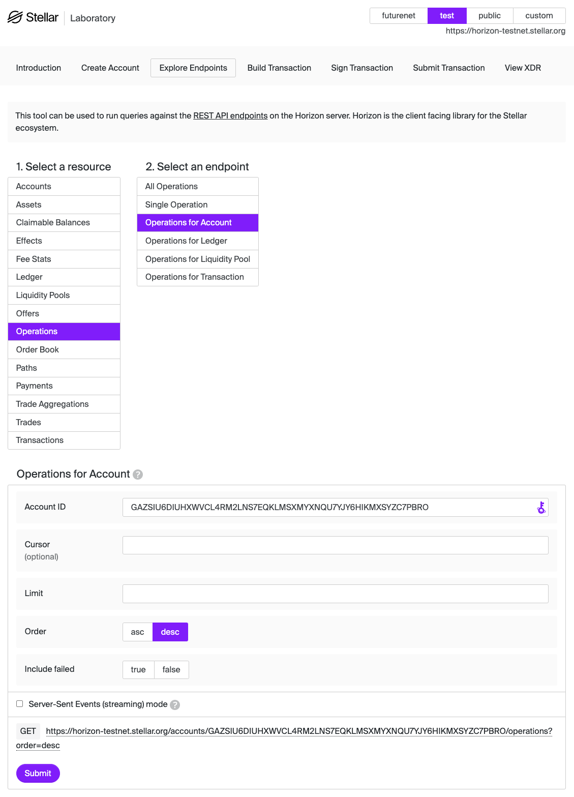
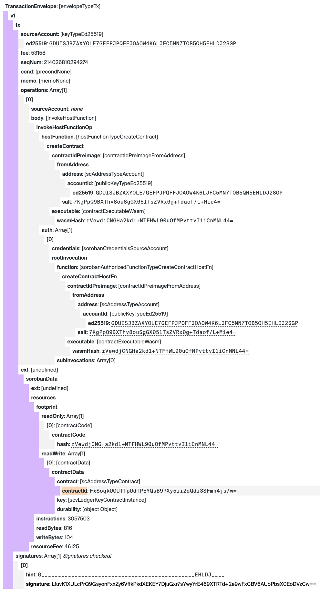

# Quest 3 - Reverse Engineer <!-- omit in toc -->

## TL;DR

You again!? You're back here looking for the quick task? Well, alright, if you
think you're really ready for it. Good luck!

**For this quest, we have already deployed the `ReverseEngineerContract` using
the account `GAEURQTDWOQU2G6GYUUH6IPVBOE5TLJJC2R3LZ5DZN6G5XFFRVMAIKOM`. You must
_find_ the `contract_address` for this contract. Then you must invoke the
correct function in that contract, while providing the correct argument.**

## Table of Contents <!-- omit in toc -->

- [TL;DR](#tldr)
- [How to Play](#how-to-play)
- [The Task at Hand](#the-task-at-hand)
  - [Explore the Contract Code](#explore-the-contract-code)
  - [Using `soroban` CLI to Decode XDR](#using-soroban-cli-to-decode-xdr)
  - [How do I find a `contract_address`?](#how-do-i-find-a-contract_address)
    - [1. Find an Operation](#1-find-an-operation)
    - [2. View the Transaction Envelope](#2-view-the-transaction-envelope)
    - [3. Decode the Contract Address](#3-decode-the-contract-address)
    - [4. Other Methods](#4-other-methods)
    - [Sidenote About Reading Deployed WASM Binaries](#sidenote-about-reading-deployed-wasm-binaries)
- [Further Reading](#further-reading)
- [Still Stuck?](#still-stuck)

## How to Play

If you missed out on our previous quests, or you just need a refresher, we have
some (pretty extensive) instructions for the _mechanics_ of completing these
quests (generating keypairs, checking your work, etc.).

All that information [can be found here][how-to-play] if you need to use those
instructions again.

## The Task at Hand

I hear you: "Let's get to the quest!!" I love your enthusiasm! But, I want to
~~implore~~ beg you to do one thing first: Read the code!

After you're done with that, you'll explore the on-chain data that is available
to you through the Stellar network. So you can find and invoke the correct
contract function with the secret password that you can only learn in one place!
(Hint: that place is in the source code!)

### Explore the Contract Code

Ok, so we've been at this a couple times before. You might feel like you're
_starting_  to understand the order of things, and how this all works. **Or**,
you might feel like you're totally lost, and you just want someone else to give
you the answer.

Whatever you're feeling, I want to put this in the most emphasized voice I can:
**Read the code that is contained within `src/lib.rs` and `src/test.rs`!** Read
it. The whole thing. Comments and all. Everything!

Trust me, you will want to read the contract for this one (all of the quests,
honestly). Sure, reading the code will help you understand the contract. Yes,
that's what we're trying to do. **But**, it will also answer many of the
questions you'll come up with as you work on this task.

### Using `soroban` CLI to Decode XDR

A term you may already be familiar with is "XDR" which stands for _e**X**ternal
**D**ata **R**epresentation_. So much of what happens on the Stellar network is
done in XDR format: transactions, ledger data, history, operation results, and
the list goes on. XDR is a compact, network-efficient, binary format. While it's
great for many things, it's not human readable, so it can be pretty confusing.

Thankfully, the [`soroban` CLI][soroban-cli] makes it pretty easy to get
decoded, useful, and understandable output from supplied XDR. For example, when
a transaction is submitted to the Network, the validators work with it in XDR
format. Here is how you could use the `soroban lab xdr decode` command to decode
a Friendbot transaction XDR into a more human-readable format.

```bash
soroban lab xdr decode \
    --type TransactionEnvelope \
    --output json-formatted \
    <<< AAAAAgAAAABIu5usRTTahvcdKMNti3923mNvvKPWQV3xI7qtMuKh2AAPQkAAAADaAAAAGAAAAAEAAAAAAAAAAAAAAAAAAAAAAAAAAAAAAAEAAAABAAAAABB90WssODNIgi6BHveqzxTRmIpvAFRyVNM+Hm2GVuCcAAAAAAAAAADoiSQ5BfDlk+YhXpfApUuA63FeWkousb+bg9gfpDrGnQAAABdIdugAAAAAAAAAAAIy4qHYAAAAQJRl+oVaaDSwh2FcfmLdsEr/72DPFt9HxtBHRS0tNFiy+PymjWsWlO0v2/UOIo85gjXxHpZ3nzp63pdr/0KTvgiGVuCcAAAAQHq1Q5lFYJHU0HILXH70DIzdbWvbsk9/dnGcEhNNlzXsSp3WXeNk8xlDx0CtrD5DqVhITfOOVMGzlRFuWN1Tews=
```

I'll omit the output here, in an attempt to keep this README un-cluttered. But,
if you were to run the above command, you'd see a human-readable representation
of a transaction creating an account with a starting balance of 10,000 XLM
(Testnet XLM, of course).

There are many different "types" you could use the `soroban` cli to decode. If
you run `soroban lab xdr types list` in your terminal, you'll see all the
different options that are available to you.

### How do I find a `contract_address`?

Have you ever heard the expression "There is more than one way to skin a cat"? I
know, it's nasty and gross! I don't know who wants to have even _one_ way to
skin a cat!! Anyway, I'm getting sidetracked...

There are a few different ways you could find a `contract_address` for an
already deployed contract. Currently, all of them involve decoding XDR. Decoding
can be done using the `soroban` cli, or the Stellar Laboratory, or RunKit, or
you could come up with your own way to decode/encode the base64 as needed. But
they all start with finding the correct XDR to decode.

The following sensible approach to finding a `contract_address` will start by
finding a relevant `operation` for the account in question, and then the
corresponding `transaction`. This definitely isn't the only way it could be done
(it's not even the quickest or easiest), but it _is_ straight-forward, and easy
to follow.

#### 1. Find an Operation

We begin by heading to the [Stellar Lab][lab] (using Testnet), and we'll click
on **Explore Endpoints** -> **Operations** -> **Operations for Account**. Enter
the public key of an account that exists on Testnet (the example here shows an
account that was used to deploy and invoke the `HelloWorld` Contract from Quest
1), and click **Submit**. (If you prefer viewing the JSON output, you can get
that [here][ops].)

<details>
<summary>View screenshot</summary>



</details>

> **Reminder:** For the _actual_ quest, you are looking for a contract that was
> deployed by this address:
> `GAEURQTDWOQU2G6GYUUH6IPVBOE5TLJJC2R3LZ5DZN6G5XFFRVMAIKOM`.

When the results appear, we're going to look for an operation where `type` is
`invoke_host_function`, **and** where the `function` is
`HostFunctionTypeHostFunctionTypeCreateContract` (i.e., this operation is an
account deploying a smart contract). Our example operation:

```json5
{
  "_links": {
    "self": {...},
    // This is the link to the transaction you want to use (again, this is only an example)
    "transaction": {
      "href": "https://horizon-testnet.stellar.org/transactions/21f329e415594da21dbe4c12e446411aa435603801bd5bf67dd1b376f5f37fab"
    },
    "effects": {...},
    "succeeds": {...},
    "precedes": {...}
  },
  "id": "214606630912001",
  "paging_token": "214606630912001",
  "transaction_successful": true,
  "source_account": "GDUISJBZAXYOLE7GEFPJPQFFJOAOW4K6LJFC5MN7TOB5QH5EHLDJ2SGP",
  // We want to find an operation where (type === "invoke_host_function")
  "type": "invoke_host_function",
  "type_i": 24,
  "created_at": "2024-02-09T18:28:45Z",
  "transaction_hash": "21f329e415594da21dbe4c12e446411aa435603801bd5bf67dd1b376f5f37fab",
  // AND the function should should be "HostFunctionTypeHostFunctionTypeCreateContract"
  "function": "HostFunctionTypeHostFunctionTypeCreateContract",
  "parameters": null,
  "address": "GDUISJBZAXYOLE7GEFPJPQFFJOAOW4K6LJFC5MN7TOB5QH5EHLDJ2SGP",
  "salt": "107042770548726611785372457388627877260558000302253805902028758166610775935470",
  "asset_balance_changes": null
}
```

> **Note**: You could also use this same technique to find some pretty useful
> information from operations where the `function` property is
> `HostFunctionTypeHostFunctionTypeInvokeContract` and there is an array of
> `parameters`. You could use those operations to see exactly what a given
> account used to invoke a given contract. Check out [this video][twitch] to
> learn a bit more!

#### 2. View the Transaction Envelope

From there, we find the link to the **transaction** that contains this
operation. It's provided in the operation's `_links.transaction` object. If
you're in the Lab, you can click on that link and it will open up the endpoint
explorer with the fields for that transaction pre-filled, and you just have to
click **Submit** once again. (For the JSON among us, you can copy/paste the link
into your browser, or you can [click here][tx].)

In the transaction information, you're looking for the `envelope_xdr` field.
This contains the (binary encoded) actual transaction that was submitted to the
network. Most pertinent to this quest, it will contain the `contractId` of the
deployed contract. In the Lab, if you click on that XDR string, it will take you
to the XDR viewer, where you can find the `contractId`.

<details>
<summary>View screenshot</summary>



</details>

Alternatively, you could copy/paste the whole Transaction Envelope string and
decode it using the `soroban` CLI to get the information you're after.

#### 3. Decode the Contract Address

With the `contractId` in hand, you'll need to figure out a way to decode that
from its [base64 encoding][twitch-clip] into a `C...` address you can use and
invoke. There are [multiple ways][sdk-encode-contract] to do that, and we've
sprinkled _a lot_ of helpful links throughout this README, so we won't exactly
spell it out here. That's all a part of the adventure!

#### 4. Other Methods

Without going into details, here are some other methods you could use to
discover a contract address from a known deployer account:

- Calculate the address by hand by correctly hashing together the network
  passphrase and the salt provided in the
  `HostFunctionTypeHostFunctionTypeCreateContract` operation.
- Use a block explorer or indexer to find relevant operations and/or
  transactions.
- Use the soroban cli to generate a contract address from a provided wasm hash
  and salt.

The possibilities are limitless!

#### Sidenote About Reading Deployed WASM Binaries

This is merely tangential to today's Quest, but it is very interesting and
useful nonetheless.

<details>
<summary>Are you curious? Go ahead. Read on...</summary>

The reason we've taken you to see the full transaction meta is to point out that
included in this XDR is also the contract's `wasmHash`! Yeah, that's right. The
unique identifier of the installed Wasm executable!

In short, when you `deploy` a Soroban contract, two things happen: first the
code is "installed" (the Wasm byte-code is uploaded, identified by its hash),
then it is "deployed" (a `contract_address` is created that points to the
installed executable's hash identifier).

It's a bit of a journey from there, and I highly suggest you take a trip to
[this part][get-wasm-code] of the [`getLedgerEntries` method][gle] on the
Soroban-RPC docs. You could ultimately retrieve the binary byte-code, decode it
from base64 into hex, and then store it as a binary `.wasm` file locally.

The resulting `.wasm` file would be **identical** to the compiled contract that
was initially deployed. You could re-deploy it, use `soroban contract inspect`
to get information about it, or whatever else you could come up with. Cool,
huh!?

Like we said, this isn't particularly pertinent to this quest, but it could come
in handy at some point for you.

</details>

## Further Reading

- [Learn more about XDR][xdr] in the Stellar Developer Documentation.
- [This episode][twitch-full] of "Soroban Talks" is **SO** useful, and can help
  you get a handle on what's happening inside of Soroban. (Hint: Starting around
  [23:14][twitch] is a _really_ useful discussion about decoding the XDR values
  into something a little more user-friendly.)
- Developers can also use the Soroban-RPC interface to interact with futurenet
  and get current state data. [The existing API docs][soroban-rpc] are still a
  work in progress, but contain some _very_ helpful information about how
  Soroban contract invocations actually happen.
- Some basic information about the usage of the `soroban` CLI can be found on
  the [Soroban Docs website][install-soroban]. In addition to that page many of
  the tutorials and examples contain example CLI commands.

## Still Stuck?

If you're hitting a brick wall, and you're not sure what your next move is,
check out [this section](../../README.md#feeling-lost) in our main README. It's
got a couple of suggestions for where you might go from here.

[how-to-play]: ../1-hello-world/README.md#how-to-play
[xdr]: https://developers.stellar.org/docs/encyclopedia/xdr
[soroban-cli]: https://soroban.stellar.org/docs/reference/soroban-cli
[lab]: https://laboratory.stellar.org/#?network=test
[ops]: https://horizon-testnet.stellar.org/accounts/GDUISJBZAXYOLE7GEFPJPQFFJOAOW4K6LJFC5MN7TOB5QH5EHLDJ2SGP/operations?order=desc
[tx]: https://horizon-testnet.stellar.org/transactions/21f329e415594da21dbe4c12e446411aa435603801bd5bf67dd1b376f5f37fab
[twitch]: https://www.twitch.tv/videos/1642865389?t=00h23m14s
[twitch-clip]: https://clips.twitch.tv/FragileSneakyOstrichGivePLZ-DK9h3VVmUjqVDDZG
[twitch-full]: https://www.twitch.tv/videos/1642865389
[soroban-rpc]: https://soroban.stellar.org/api
[install-soroban]: https://soroban.stellar.org/docs/getting-started/setup#install-the-soroban-cli
[gle]: https://soroban.stellar.org/api/methods/getLedgerEntries
[get-wasm-code]: https://soroban.stellar.org/api/methods/getLedgerEntries#requesting-a-contracts-wasm-code
[sdk-encode-contract]: https://stellar.github.io/js-stellar-sdk/StrKey.html#.encodeContract
