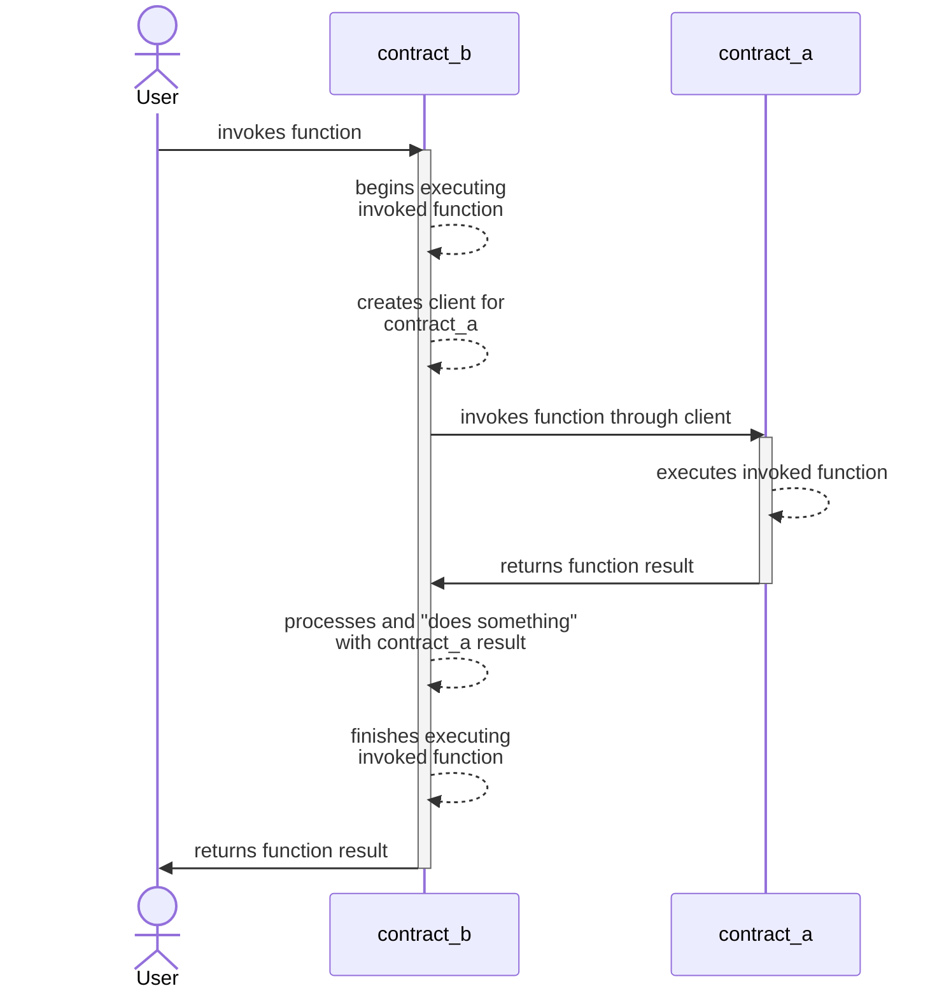

# Quest 4 - Cross Contract <!-- omit in toc -->

## TL;DR

You again!? You're back here looking for the quick task? Well, alright, if you
think you're really ready for it. Good luck!

**For this quest, you'll use your Quest Account to deploy the `DataStore`
contract from Quest 2, invoking its `put` function to store some data on chain.
You must also use your Quest Account to deploy _this_ Quest's
`CrossContractCall` contract, and use it to make a cross-contract invocation of
the `get` function from your `DataStore` contract.**

## Table of Contents <!-- omit in toc -->

- [TL;DR](#tldr)
- [How to Play](#how-to-play)
- [The Task at Hand](#the-task-at-hand)
  - [Making an On-Chain Oracle](#making-an-on-chain-oracle)
  - [Importing Contracts](#importing-contracts)
  - [Using a Contract Client](#using-a-contract-client)
  - [Passing Arguments to Soroban CLI](#passing-arguments-to-soroban-cli)
- [Further Reading](#further-reading)
- [Still Stuck?](#still-stuck)

## How to Play

If you missed out on our previous quests, or you just need a refresher, we have
some (pretty extensive) instructions for the _mechanics_ of completing these
quests (generating keypairs, checking your work, etc.).

All that information [can be found here][how-to-play] if you need to use those
instructions again.

## The Task at Hand

We know you're excited, and ready to get questing! But, again, please please
please: **Read the code!!** There is important stuff that you need to know
inside of there.

Now, let's talk theory:

### Making an On-Chain Oracle

A blockchain "oracle" might seem like one of those buzz-words that _sounds_ like
something cool, but you're not really sure what it's supposed to mean. You could
think of an oracle as a window into the "outside world" from within a
blockchain. An oracle provides outside data for use in the network. You could
make one that pulls in all kinds of data! Maybe it's:

- weather data from around the world,
- the current speedrunning records for Super Mario,
- football scores and rankings leading up to the World Cup,
- the price of Bitcoin against another asset,
- you get the idea... it could be pretty much anything!

An oracle could also exist a bit like an on-chain database. Maybe you populate
it with the public addresses of your closest friends (or your enemies). Or, you
could store your recipes for delicious guacamole. That data is then available
for use in other smart contracts, where you might need to use that data for
various (nefarious?) purposes. Pretty cool, right!?

Perhaps you could re-purpose the Quest 2 contract to be some kind of on-chain
datastore that contains whatever you want! To do that, you'll need to _import_
it into another contract.

### Importing Contracts

So, you have a contract that you want to invoke from inside your own? And, you
want to know how it's done? In order to invoke `contract_a` from inside
`contract_b`, you first must import the compiled `contract_a` binary into your
code for `contract_b`. Doing so makes a couple things happen inside
`contract_b`:

- any custom types that are declared in `contract_a` are now useable in
  `contract_b`
- a `ContractClient` is generated that can be used to invoke `contract_a`
  functions

Here's how this might play out in a pretend `contract_b/src/lib.rs` file.

```rust
// We put this inside a `mod{}` block to avoid collisions between type names.
mod contract_a {
    soroban_sdk::contractimport!(file = "../relative/path/to/contract_a.wasm");
}
```

> **Note:** When importing a contract file into another contract, it's a good
> time to think about whether or not you want to optimize your build process.
> You can read more about [Optimizing Builds][optimizing] in the Soroban docs,
> or you could come experiment with us in [fca00c][fca00c].

#### **Caveat on Contract Compilation Order** <!-- omit in toc -->

When importing a contract's `.wasm` file into another contract's source code,
the compiled `contract_a.wasm` file (in the above example) must _already exist_,
or Rust will let you know forcefully that it cannot find the referenced file.

### Using a Contract Client

Once `contract_a` has been imported into `contract_b`, utilizing a
cross-contract call is quite simple. The process unfolds like this:

- `contract_b` creates a client it will use to invoke functions in `contract_a`
- `contract_b` makes its invocations using that client, and supplying any
  arguments that may be required
- `contract_a` runs the invoked function and returns its response to
  `contract_b`
- `contract_b` then takes the response and does whatever is needed with it
  (returns all or part of the response to the invoker, processes the response
  and returns something else, calls yet another contract, you get the idea...)

We've illustrated this in the diagram below:



You can think of this contract client as if it were an existing "module" that
you're using in your own contract. Not too bad, Soroban my ol' buddy!

### Passing Arguments to Soroban CLI

In case you haven't realized yet, Soroban depends on [Remote Procedure Call
(RPC)][rpc-wiki] to pass messages between clients and the network. RPC is used
by a client to request that a server should run a function, and which arguments
it should supply. The server then runs the function, and reports back to the
client. The advantage of this approach is that the function doesn't have to
exist or run in the client. Here's [an illustrated article][rpc-gforg] on
GeeksforGeeks that goes much further in depth.

Specifically, Soroban utilizes [JSON-RPC][jsonrpc] to pass and read messages
between clients and servers. So, in _some_ cases you can pass a JSON(-ish)
string as an argument to a contract's function. Other times, you can just supply
the value you want to the argument, no JSON-ing required! It can be a bit tricky
to get the hang of, but you'll get used to it in no time.

In order for your cli arguments (the parts of the RPC message) to be passed
along to your contract, you must use a `--` double-dash. (Fun fact: `--` is
sometimes called a "slop"!) [This "Hello World" tutorial][hello-world-tut] has a
lot more information, but I'll demonstrate how you might use this syntax to
authenticate and increment a counter, taken from the [Auth tutorial][auth].

```bash
soroban contract invoke \
    --id C... \
    -- \
    increment \
    --user GAJGHZ44IJXYFNOVRZGBCVKC2V62DB2KHZB7BEMYOWOLFQH4XP2TAM6B \
    --value 2
```

In the above example, the values are specified simply as strings. There are
other situations where that may not be possible, and you'll have to use
something a bit _fancier_. Suppose you wish to supply an argument for a
contract's function that requires you to specify a custom type you've created.
You may need to pass it in the cli like this:

```bash
soroban contract invoke \
    --id C... \
    -- \
    foo \
    --address '{"cylinder":{"radius":3,"height":14}}'
```

You can see that it's very much like a JSON object. Often the `soroban` cli is
smart enough to figure out what kind of argument you're _trying_ to supply, and
doing the JSON for you. It will let you know when it can't, though.

## Further Reading

- The [Cross Contract Calls guide][ccc-example] in the Soroban documentation has
  even more details and hints regarding this topic.
- Read more about [`traits` in Rust][rust-traits] in The Rust Reference
- The "Learn" section of the Soroban documentation has an article all about
  [interacting with contracts][interacting-contracts], and it's **definitely**
  worth the read!
- We didn't explore the finer details of keeping data on chain in this quest,
  but there is so much more to learn about this! Especially with Soroban's novel
  system of [state archival][state-archival]! Please check out the [persisting
  data][persisting-data] article in the Soroban documentation.

## Still Stuck?

If you're hitting a brick wall, and you're not sure what your next move is,
check out [this section](../../README.md#feeling-lost) in our main README. It's
got a couple of suggestions for where you might go from here.

[how-to-play]: ../1-hello-world/README.md#how-to-play
[ccc-example]: https://soroban.stellar.org/docs/basic-tutorials/cross-contract-call
[rpc-wiki]: https://en.wikipedia.org/wiki/Remote_procedure_call
[rpc-gforg]: https://www.geeksforgeeks.org/remote-procedure-call-rpc-in-operating-system/
[jsonrpc]: https://www.jsonrpc.org/
[auth]: https://soroban.stellar.org/docs/basic-tutorials/auth#run-the-contract
[optimizing]: https://soroban.stellar.org/docs/getting-started/hello-world#optimizing-builds
[rust-traits]: https://doc.rust-lang.org/book/ch10-02-traits.html
[interacting-contracts]: https://soroban.stellar.org/docs/fundamentals-and-concepts/interacting-with-contracts
[persisting-data]: https://soroban.stellar.org/docs/fundamentals-and-concepts/persisting-data
[hello-world-tut]: https://soroban.stellar.org/docs/getting-started/deploy-to-testnet#interact
[fca00c]: https://fastcheapandoutofcontrol.com
[state-archival]: https://soroban.stellar.org/docs/fundamentals-and-concepts/state-archival
